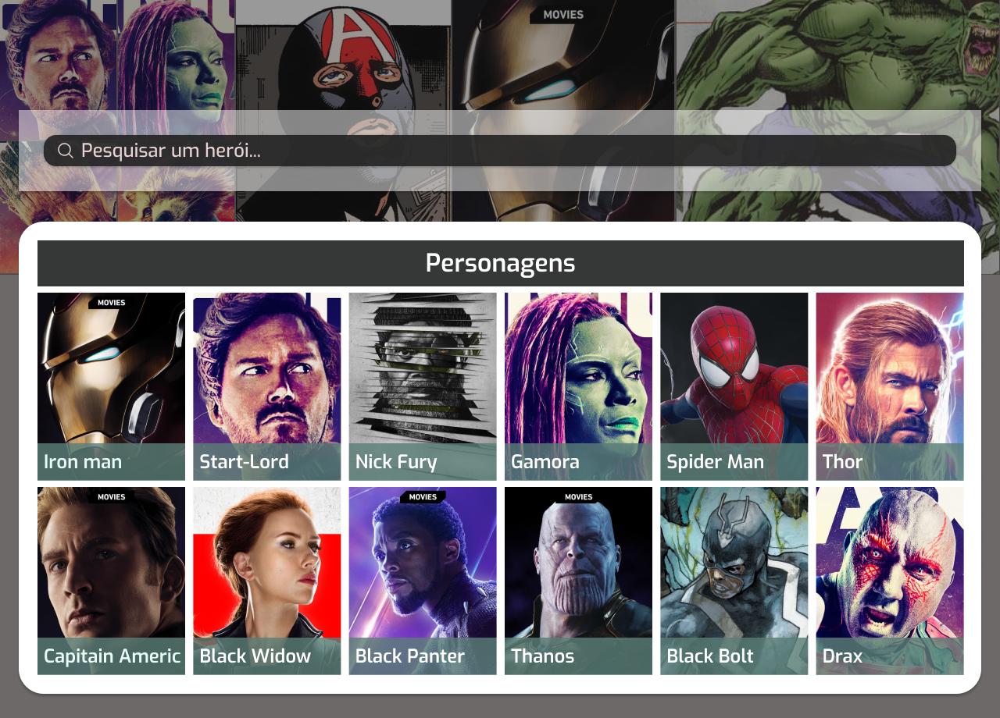

# Marvel Heroes



<br />
<br />

Esta é uma [aplicação web](https://marvel-heroes-samuel.vercel.app) que consulta API da Marvel para pesquisa de heróis. Esse projeto foi criado com uma estrutura clara e independente, conhecida como Clean Architecture, para distribuir as responsabilidades em diferentes camadas. Ele segue os princípios do SOLID, DRY, YAGNI e KISS, e utiliza padrões de design para solucionar problemas comuns. Em resumo, esse projeto possui uma arquitetura bem organizada e modular, com foco na reutilização de código e simplicidade, aplicando boas práticas de desenvolvimento.

## 🚀 Tecnologias

Esse projecto foi desenvolvido com as seguintes tecnologias:

- [Typescript](https://www.typescriptlang.org/)
- [ReactJs](https://react.dev)
- [Styled components](https://styled-components.com/)
- [Figma] ()
#

## Aplicação em produção
Acede Link do deploy: https://marvel-heroes-samuel.vercel.app

## Como baixar/executar o projecto em sua máquina

- Baixe/clone o projecto executando o comando 
```
git clone https://github.com/samuelfreitas-ao/marvel-heroes
```

- Acede a pasta do projecto e instale as dependências: 
```
npm install
```

- Faça uma cópia do arquivo `.env.example` para `.env` na raíz do projecto e preencha corretamente a variável `VITE_PUBLIC_KEY` e `VITE_PRIVATE_KEY` com as chaves da api da Marvel ([https://developer.marvel.com](https://developer.marvel.com)).

- Para iniciar projecto execute o comando: 
```
npm run dev
``` 
- Agora basta aceder pelo navegador o endereço: http://localhost:5173 e já está 😉.